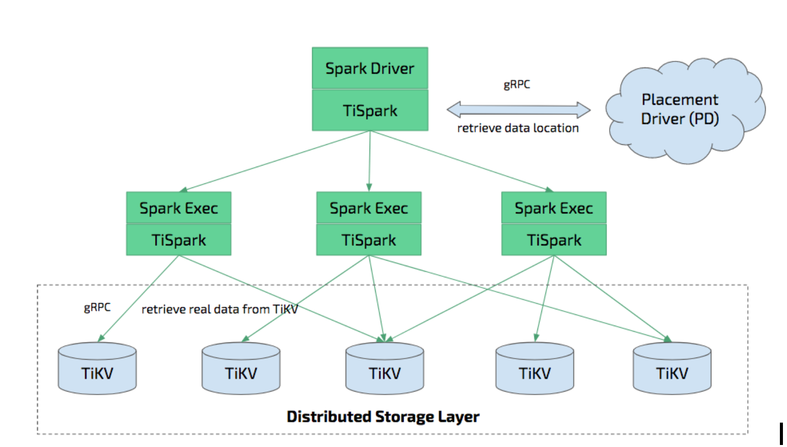

# TiSpark

[](https://maven-badges.herokuapp.com/maven-central/com.pingcap.tispark/tispark-core)
[](http://javadoc.io/doc/com.pingcap.tispark/tispark-core)
[](https://codecov.io/gh/pingcap/tispark?branch=master)
[](https://github.com/pingcap/tispark/blob/master/LICENSE)

TiSpark is a thin layer built for running Apache Spark on top of TiDB/TiKV to answer complex OLAP queries. It enjoys the merits of both the Spark platform and the distributed clusters of TiKV while seamlessly integrated to TiDB, a distributed OLTP database, to provide one-stop Hybrid Transactional/Analytical Processing (HTAP) solutions for online transactions and analyses.

## Quick start

Read the [Quick Start](./docs/userguide.md).

## Getting TiSpark

+ Currently, TiSpark 2.1.9 is the latest stable version, which is highly recommended. It is compatible with Spark 2.3.0+ and Spark 2.4.0+. It is also compatible with TiDB-2.x and TiDB-3.x.
  - When using TiSpark 2.1.9 with Spark 2.3.0+, use version `2.1.9-spark_2.3` and follow the [document for Spark 2.3+](./docs/userguide.md).
  - When using TiSpark 2.1.9 with Spark 2.4.0+, use version `2.1.9-spark_2.4` and follow the [document for Spark 2.3+](./docs/userguide.md).

+ TiSpark 1.2.1 is the latest stable version compatible with Spark 2.1.0+.
  - When using TiSpark 1.2.1, follow the [document for Spark 2.1](./docs/userguide_spark2.1.md).

You might also [build from sources](#how-to-build-from-sources) to try the new features on TiSpark master branch.

If you are using maven (recommended), add the following code to your `pom.xml`:
```xml
<dependencies>
    <dependency>
      <groupId>com.pingcap.tispark</groupId>
      <artifactId>tispark-core</artifactId>
      <version>2.1.9-spark_${spark.version}</version>
    </dependency>
</dependencies>
```


If you want to use TiSpark-2.2.x, please use the following configuration:
```xml
<dependencies>
    <dependency>
      <groupId>com.pingcap.tispark</groupId>
      <artifactId>tispark-assembly</artifactId>
      <version>2.2.0</version>
    </dependency>
</dependencies>
```

For other build tools, visit <https://search.maven.org/> and search with GroupId [](http://search.maven.org/#search%7Cga%7C1%7Cpingcap). This search also lists all the available modules of TiSpark including tikv-client.

## How to build from sources

TiSpark now supports Spark 2.3.0+ or 2.4.0+. The earlier TiSpark versions for Spark 2.1.0+ only contain bug-fixes. After these versions, you can still get support for Spark 2.1 until TiSpark 1.2.1.

Currently `java8` is the only choice to build TiSpark, run `mvn -version` to check.

```
git clone https://github.com/pingcap/tispark.git
```

To build all TiSpark modules from sources, run the following command under the TiSpark root directory:

```
mvn clean install -Dmaven.test.skip=true
```

To skip the tests that you do not need to run, add `-Dmaven.test.skip=true`.

## How to choose TiSpark Version

| Spark Version | Recommended TiSpark Version |
| ------------- | ---------------------- |
| Spark-2.4.x | TiSpark-2.2.0、TiSpark-2.1.9 |
| Spark-2.3.x | TiSpark-2.2.0、TiSpark-2.1.9 |
| Spark-2.2.x | TiSpark-1.2.1 |
| Spark-2.1.x | TiSpark-1.2.1 |

## Latest TiDB/TiKV/PD versions supported by TiSpark

| TiSpark Version | Latest TiDB Version | Latest TiKV Version | Latest PD Version |
| ----- | ------ | ------ | ------ |
| < 1.2 | v2.1.9 | v2.1.9 | v2.1.9 |
| 1.2.x | v2.1.x | v2.1.x | v2.1.x |
| 2.x | v3.0.2 | v3.0.2 | v3.0.2 |
| Latest (master) | v3.0.12 | v3.0.12 | v3.0.12 |

## Spark versions supported by TiSpark

Although TiSpark provides backward compatibility to TiDB, it only guarantees the **restricted** support for the earlier Spark versions to follow the latest DataSource API changes.

| TiSpark Version | Spark Version |
| ----- | ------ |
| 1.x | Spark v2.1.0+ |
| 2.0 | Spark v2.3.0+ |
| 2.1.x | Spark v2.3.0+, Spark v2.4.0+ |
| 2.2.x | Spark v2.3.0+, Spark v2.4.0+ |
| Latest (master) | Spark v2.3.0+, Spark v2.4.0+ |

## How to upgrade from Spark 2.1 to Spark 2.3/2.4

For the users of Spark 2.1 who wish to upgrade to the latest TiSpark version on Spark 2.3/2.4, download or install Spark 2.3+/2.4+ by following the instructions on [Apache Spark Site](http://spark.apache.org/downloads.html) and overwrite the old spark version in `$SPARK_HOME`.

## Scala Version

TiSpark currently only supports `scala-2.11`.

## TiSpark Architecture

The figure below show the architecture of TiSpark.



+ TiSpark integrates well with the Spark Catalyst Engine. It provides precise control of computing, which allows Spark to read data from TiKV efficiently. It also supports index seek, which significantly improves the performance of the point query execution.
+ It utilizes several strategies to push down computing to reduce the size of dataset handling by Spark SQL, which accelerates query execution. It also uses the TiDB built-in statistical information for the query plan optimization.
+ From the perspective of data integration, TiSpark + TiDB provides a solution that performs both transaction and analysis directly on the same platform without building and maintaining any ETLs. It simplifies the system architecture and reduces the cost of maintenance.
+ In addition, you can deploy and utilize the tools from the Spark ecosystem for further data processing and manipulation on TiDB. For example, using TiSpark for data analysis and ETL, retrieving data from TiKV as a data source for machine learning, generating reports from the scheduling system and so on.

TiSpark relies on the availability of TiKV clusters and PDs. You also need to set up and use the Spark clustering platform.

Most of the TiSpark logic is inside a thin layer, namely, the [tikv-client](https://github.com/pingcap/tispark/tree/master/tikv-client) library.

## Quick Start

Before everything starts,

+ add `spark.sql.extensions  org.apache.spark.sql.TiExtensions` in `spark-defaults.conf`.
+ ensure that `spark.tispark.pd.addresses` is set correctly.

From Spark-shell:

```
./bin/spark-shell --jars /wherever-it-is/tispark-${name_with_version}.jar
```

For TiSpark version >= 2.0:

```
spark.sql("use tpch_test")
spark.sql("select count(*) from lineitem").show
```

For TiSpark version < 2.0:

```
import org.apache.spark.sql.TiContext
val ti = new TiContext (spark)
ti.tidbMapDatabase ("tpch_test")

spark.sql("select count(*) from lineitem").show
```

> **Note:**
>
> If you use TiSpark 2.0+, for spark-submit on Pyspark, `tidbMapDatabase` is still required and `TiExtension` is not supported yet. PingCAP is working on this issue.

## Current Version

```
spark.sql("select ti_version()").show
```

## Write Data To TiDB using TiDB Connector
TiSpark natively supports writing data to TiKV via Spark Data Source API and guarantees ACID.

For example:

```scala
// tispark will send `lock table` command to TiDB via JDBC
val tidbOptions: Map[String, String] = Map(
  "tidb.addr" -> "127.0.0.1",
  "tidb.password" -> "",
  "tidb.port" -> "4000",
  "tidb.user" -> "root",
  "spark.tispark.pd.addresses" -> "127.0.0.1:2379"
)

val customer = spark.sql("select * from customer limit 100000")

customer.write
.format("tidb")
.option("database", "tpch_test")
.option("table", "cust_test_select")
.mode("append")
.save()
```

See [here](./docs/datasource_api_userguide.md) for more details.

## Configuration

The configurations in the table below can be put together with `spark-defaults.conf` or passed in the same way as other Spark configuration properties.

|    Key    | Default Value | Description |
| ---------- | --- | --- |
| `spark.tispark.pd.addresses` |  `127.0.0.1:2379` | The addresses of PD cluster, which are split by comma |
| `spark.tispark.grpc.framesize` |  `268435456` | The maximum frame size of gRPC response |
| `spark.tispark.grpc.timeout_in_sec` |  `10` | The gRPC timeout time in seconds |
| `spark.tispark.plan.allow_agg_pushdown` |  `true` | Whether aggregations are allowed to push down to TiKV (in case of busy TiKV nodes) |
| `spark.tispark.plan.allow_index_read` |  `true` |  Whether index is enabled in planning (which might cause heavy pressure on TiKV) |
| `spark.tispark.index.scan_batch_size` |  `20000` | The number of row key in batch for the concurrent index scan |
| `spark.tispark.index.scan_concurrency` |  `5` | The maximal number of threads for index scan that retrieves row keys (shared among tasks inside each JVM) |
| `spark.tispark.table.scan_concurrency` |  `512` | The maximal number of threads for table scan (shared among tasks inside each JVM) |
| `spark.tispark.request.command.priority` |  `Low` | The value options are `Low`, `Normal`, `High`. This setting impacts the resource to get in TiKV. `Low` is recommended because the OLTP workload is not disturbed. |
| `spark.tispark.coprocess.streaming` |  `false` | Whether to use streaming for response fetching (experimental) |
| `spark.tispark.plan.unsupported_pushdown_exprs` |  `""` | A comma-separated list of expressions. In case you have a very old version of TiKV, you might disable some of the expression push-down if they are not supported.  |
| `spark.tispark.plan.downgrade.index_threshold` | `1000000000` | If the range of index scan on one Region exceeds this limit in the original request, downgrade this Region's request to table scan rather than the planned index scan. By default, the downgrade is disabled. |
| `spark.tispark.show_rowid` |  `false` | Whether to show the implicit row ID if the ID exists |
| `spark.tispark.db_prefix` |  `""` | The string that indicates the extra prefix for all databases in TiDB. This string distinguishes the databases in TiDB from the Hive databases with the same name. |
| `spark.tispark.request.isolation.level` |  `SI` | Isolation level means whether to resolve locks for the underlying TiDB clusters. When you use the "RC", you get the latest version of record smaller than your `tso` and ignore the locks. If you use "SI", you resolve the locks and get the records depending on whether the resolved lock is committed or aborted.  |
| `spark.tispark.coprocessor.chunk_batch_size` | `1024` | How many rows fetched from Coprocessor |
| `spark.tispark.isolation_read_engines` | `"tikv,tiflash"` | List of readable engines of TiSpark, comma separated, storage engines not listed will not be read |

## `Log4j` Configuration

When you start `spark-shell` or `spark-sql` and run query, you might see the following warnings:
```
Failed to get database ****, returning NoSuchObjectException
Failed to get database ****, returning NoSuchObjectException
```
where `****` is the name of database.

The warnings are benign and occurs because Spark cannot find `****` in its own catalog. You can just ignore these warnings.

To mute them, append the following text to `${SPARK_HOME}/conf/log4j.properties`.

```
# tispark disable "WARN ObjectStore:568 - Failed to get database"
log4j.logger.org.apache.hadoop.hive.metastore.ObjectStore=ERROR
```

## Time Zone

Set time zone by using the `-Duser.timezone` system property (for example, `-Duser.timezone=GMT-7`), which affects the `Timestamp` type.

Do not use `spark.sql.session.timeZone`.

## Statistics information

For how TiSpark can benefit from TiDB's statistic information, see [here](./docs/userguide.md).

## Compatibility with TiDB 3.0

### View

TiDB starts to support `view` since `tidb-3.0`.

TiSpark currently **does not support** `view`. Users are not be able to observe or access data through `view` with TiSpark.

### Table Partition

`tidb-3.0` supports both `Range Partition` and `Hash Partition`.

TiSpark currently supports `Range Partition` and `Hash Partition`. Users can select data from the `Range Partition` table and the `Hash Partition` table through TiSpark.

In most cases, TiSpark use a full table scan on partition tables. Only in certain cases, TiSpark applies partition pruning. For more details, see [here](./docs/userguide.md).

## Upgrade from TiDB-2.x to TiDB-3.x
When upgrading from TiDB-2.x to TiDB-3.x,
1. make sure that you are using at least TiSpark-2.1.2 (TiSpark-2.1.9 is highly recommended).
2. `tidbMapDatabase` is deprecated after TiSpark-2.x, make sure that you are not using it.

## Example Programs
There are some [sample programs](https://github.com/pingcap/tispark-test/tree/master/tispark-examples) for TiSpark. You can run them locally or on a cluster following the document.

## How to test

TiDB uses [docker-compose](https://docs.docker.com/compose/) to provide the TiDB cluster service which allows you to run test across different platforms.

It is recommended to install Docker to conduct the test locally, or to set up your own TiDB cluster locally as you wish.

For the former method, you can use `docker-compose up -d` to launch TiDB cluster service under the home directory of TiSpark. To see the logs of TiDB cluster, launch TiDB cluster service via `docker-compose up`. To shut down the entire TiDB cluster service, use `docker-compose down`. All the data is stored in the `data` directory at the root of this project. You can change it as you like.

For more details about the test, see [here](./core/src/test/Readme.md).

## Follow us

### Twitter

[@PingCAP](https://twitter.com/PingCAP)

### Mailing list

tidb-user@googlegroups.com

[Google Group](https://groups.google.com/forum/#!forum/tidb-user)

## License

TiSpark is under the Apache 2.0 license. See the [LICENSE](./LICENSE) file for details.
