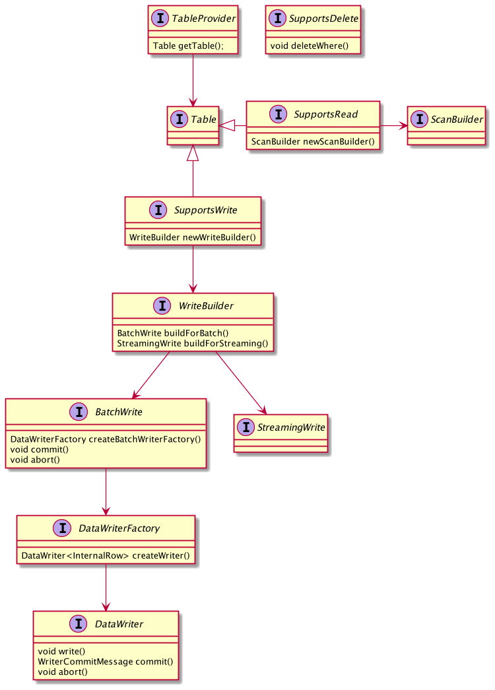
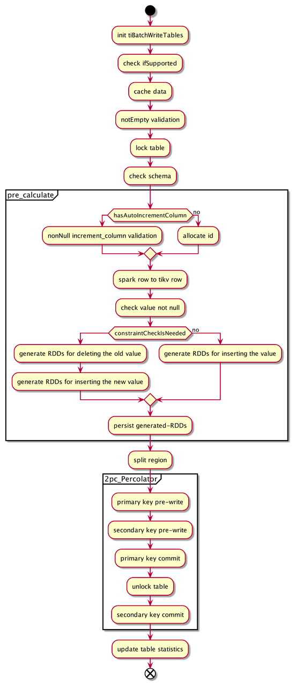

# TiSpark Design Documents

- Author(s): shiyuhang0
- Tracking Issue: https://github.com/pingcap/tispark/issues/2242

## Table of Contents

* [Introduction](#introduction)
* [Motivation or Background](#motivation-or-background)
* [Detailed Design](#detailed-design)
    * [Obsolete non catalog plugin mode](#obsolete-non-catalog-plugin mode)
    * [Move the dependency of V1 in Catalyst](move-the-dependency-of-V1-in-Catalyst)
    * [Replace API v1 to v2](replace-api-v1-to-v2)
    * [rewrite writing code](rewrite-writing-code)
* [Compatibility](#compatibility)
* [Test Design](#test-design)
* [Impacts & Risks](#impacts--risks)

## Introduction

Replace Data Source API V1 to V2 in TiSpark.

## Motivation or Background

TiSpark uses Datasource API V1 in writing API and catalyst, And spark 3.0 has introduced the Datasource API V2 which allows for a lot of great new possibilities. In my view, Datasource API V2 at least has the following advantages for TiSpark
- support delete
- support spark streaming

Of course, there are lots of other benefits for V2. I think V2 is most likely going to be the key way to interact with datasource in the future for Spark, so I'd like to replace V1 API with V2.

## Detailed Design

DSV2 support is a big change to TiSpark framework. I think we need to do the following things:

| Task                                  | Influence                                     |
|---------------------------------------|-----------------------------------------------|
| Obsolete non catalog plugin mode      | don't support non catalog plugin mode anymore |
| Move the dependency of V1 in Catalyst | /                                             |
| Replace API v1 to v2                  | /                                             | 
| Rewrite original writing code         | /                                             |

### Obsolete non catalog plugin mode
Spark did not provide multiple catalog API in the early days. So, TiSpark inject Catalog by catalyst extension to support non catalog plugin mode. Also, it uses DataSource API V1 TiDBRelation to provide schema information.

Now, TiSpark can extend catalog with multiple catalog API, and we want to replace v1 to v2. SO, I think it's a good time to obsolete non catalog plugin mode.

We need to do the following things
- Delete the corresponding codes
    - TiParser
    - TiDDLRule
    - org.apache.spark.sql.execution.command
    - TiResolutionRule
    - TiCompositeSessionCatalog
    - TiConcreteSessionCatalog
    - TiDirectExternalCatalog
- Fix some codes
    - Some tests
    - TiAuthIntegrationSuite
- Update user doc
- Update CI

### Move the dependency of V1 in Catalyst
TiSpark expanded spark with catalyst extension. However, it depends on `TiDBRelation` which is API v1. We need to use TiDBTable instead.

In order to support catalog plugin, TiSpark already has TiDBTable. But it needs to extend more interface and needs more necessary information to replace `TiDBRelation`

The following things need to do:
1. Rewrite `TiDBTable` in TiCatalog
    - It's schema information should not depend on v1
    - More information is needed
      - Tisession
      - MetaManager
      - TiTableReference
      - SqlContext
    - Extend more interface
      - SupportsRead interface
2. `TiDBRelation` -> `TiDBTable` in TiResolutionRuleV2
3. Replace the use of `TiDBRelation` in `TiAuthorizationRule` and `TiStrategy`
    - Need to research the logical plan of every statement we support, Because it may change in v2.
      
### Replace API v1 to v2
API v2 has plenty of differences from v1
- Provides job-level consistency in BatchWrite and patition-level consistency in DataWrite
- Supports Streaming
- No longer depend on dataframe/dataset, SparkSession and saveMode
- Data is processed by every record in DataWrite.write

The main APIs are described in the picture:

We need to write the framework of API v2 just like the picture shows.

### rewrite writing code
Now, the main writing process in TiSpark is as follows:

This can be simplified into three steps
1. Check
2. Pre-calculate
3. 2PC

Original writing runs on spark driver, Ir relies heavily on RDD, and it needs TiConext which contains SparkSession and TiSession.

In DataSouce API V2, write runs in spark executor, It don't have concepts of RDD or SparkSession. Data will be processed in partition with every single record rather than the whole RDD.

So, writing codes needs to be changed a lot:
1. Cache data to a batch in memory
2. Once the data reaches the max batch number, write to TiKV
    1. Check
    2. Rewrite the code which uses RDD and SparkSession in Pre-calculate
    3. Rewrite the code which uses RDD in 2PC

TODO：How to guarantee global transaction in write？

In TiKV, we should insert data in 2PC
- Primary pre-write
- secondary pre-write
- Primary commit
- secondary commit

DSV2 can support transactions at partition level easily. However, global transaction is hard to do. If you want support global transactions, a coordinator is needed. It used to be spark driver, but now it has some problems
- Spark driver can't get data anymore
- How can spark driver support 2PC ? It can only be informed after all executors finish their task and the execute commit. However, we need 2PC rather than 1PC

## Compatibility

Don't support operating TiDB in non catalog plugin anymore.
For Example , if you want operate TiDB. You must do two things below:
1. Enable Catalog by two configs
   1. spark.sql.catalog.tidb_catalog org.apache.spark.sql.catalyst.catalog.TiCatalog
   2. spark.sql.catalog.tidb_catalog.pd.addresses $pdAdress
2. Execute spark.sql("use tidb_catalog")

If you miss any step, you can only operate hive rather than TiDB（It is supported before）

## Test Design

Need to pass the currently IT.

## Impacts & Risks

The Tispark framework will be better :)
