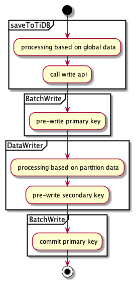

# TiSpark Design Documents

- Author(s): shiyuhang0
- Tracking Issue: https://github.com/pingcap/tispark/issues/2242

## Table of Contents

* [Introduction](#introduction)
* [Motivation or Background](#motivation-or-background)
* [Detailed Design](#detailed-design)
    * [Obsolete non catalog plugin mode](#obsolete-non-catalog-plugin-mode)
    * [Move the dependency of V1 in Catalyst](#move-the-dependency-of-v1-in-catalyst)
    * [Replace API v1 to v2](#replace-api-v1-to-v2)
    * [rewrite writing code](#rewrite-writing-code)
* [Compatibility](#compatibility)
* [Test Design](#test-design)
* [Impacts & Risks](#impacts--risks)

## Introduction

Replace Data Source API V1 to V2 in TiSpark.

## Motivation or Background

TiSpark uses Datasource API V1 in writing API and catalyst, And spark 3.0 has introduced the Datasource API V2 which allows for a lot of great new possibilities. In my view, Datasource API V2 at least has the following advantages for TiSpark
- support delete
- support spark streaming

There are lots of other benefits for V2. I think V2 is most likely going to be the key way to interact with datasource in the future for Spark, so I'd like to replace V1 API to V2 API.

## Detailed Design

DSV2 support is a big change to TiSpark framework. We need to do the following things:

| Task                                  | Influence                                     |
|---------------------------------------|-----------------------------------------------|
| Obsolete non catalog plugin mode      | don't support non catalog plugin mode anymore |
| Move the dependency of V1 in Catalyst | /                                             |
| Replace API v1 to v2                  | /                                             | 
| Rewrite original writing code         | /                                             |

### Obsolete non catalog plugin mode
Spark did not provide multiple catalog API in the early days. So, TiSpark inject Catalog by catalyst extension to support non catalog plugin mode. Also, it uses DataSource API V1 TiDBRelation to provide schema information.

Now, TiSpark can extend catalog with multiple catalog support, and we want to replace v1 to v2. So, I think it's a good time to obsolete non catalog plugin mode.

We need to do the following things
1. Delete the corresponding codes
    - TiParser
    - TiDDLRule
    - org.apache.spark.sql.execution.command
    - TiResolutionRule
    - TiCompositeSessionCatalog
    - TiConcreteSessionCatalog
    - TiDirectExternalCatalog
2. Fix some codes
    - Some tests
    - TiAuthIntegrationSuite
3. Update user doc
4. Update CI

### Move the dependency of V1 in Catalyst
TiSpark expanded spark with catalyst extension. However, it depends on `TiDBRelation` which is API v1. We need to use TiDBTable instead.

1. Add `TiDBTableProvider` as the entrance for datasource api v2
2. ReWrite `TiDBTable`: in order to support catalog plugin, TiSpark already has `TiDBTable`. But it needs to extend more interface and needs more necessary information to replace `TiDBRelation`
   - It's schema information should not depend on v1
   - More information is needed: Tisession, table, TiTableReference, SqlContext
   - Extend more interface: SupportsRead interface
3. Remove `TiResolutionRuleV2`
4. Replace the use of `TiDBRelation` in `TiAuthorizationRule` and `TiStrategy`
5. Move the `TiAuthorizationRule` from wrapper to core becauase it is compatible with spark 3.0 and 3.1 now
6. Move the  `TiStrategy` from core to wrapper becauase the logical plan `DataSourceV2ScanRelation` is different in spark 3.0 and 3.1

      
### Replace API v1 to v2
API v2 has plenty of differences from v1
- Provides job-level consistency in BatchWrite and partition-level consistency in DataWrite
- Supports Streaming
- No longer depend on RDD, SparkSession and saveMode
- Data is processed by single record in DataWrite.write

The main APIs are described in the picture:


We will extend SupportsRead and SupportsWrite.
- As for SupportsRead, we just extend it for schema. the read logical and push down logical are in TiStrategy.
- As for SupportsWrite, we implement v1WriteBuilder insteadof WriteBuilder. So we can use original write logical in v2 framework berfore rewrite writing code.

Because we replace API v1 with v2, `dataset.writeto` is available now. but it is experimental because it will involved with catalyst

### rewrite writing code
> Not implemented yet

Now, the main write step in TiSpark 
1. Check
2. Pre-calculate
3. 2PC

The detail is as follows:


Original write runs on spark driver, Ir relies heavily on RDD, and it needs TiConext which contains SparkSession and TiSession. 
In DataSouce API V2, write runs in spark executor, it don't have concepts of RDD or SparkSession. Data will be processed with every single record rather than the whole RDD.

So, writing codes needs to be changed a lot:
1. Processing the whole data, like deduplication，pre split region, etc.
2. Pre-write primary key
3. Processing the single data
   - transform data
   - cache data to a batch in memory
   - Pre-write secondary key Once the data reaches the max batch number
4. After all data have been pre-write, commit primary key



We don't implement it temporarily for two reasons
- we need to change the api expose to user because we have to deal with the global data in advance
- the optimization of the catalyst conflicts with the write logical. such as data type convert

We will do this task after solving these two problems.

## Compatibility

1.Don't support operating TiDB without catalog config anymore. Now, you must:
- Enable Catalog by these configs
```
spark.sql.catalog.tidb_catalog org.apache.spark.sql.catalyst.catalog.TiCatalog
spark.sql.catalog.tidb_catalog.pd.addresses $pdAdress
```
- Use catalog for tidb before sql `spark.sql("use tidb_catalog")`

2.The following usage is no longer supported, because is a datasource v1 read/write path
```
sprak.sql("use spark_catalog")  
spark.sql("create table xxx using tidb")
spark.sql("select * from xxx") 
spark.sql("insert into xxx")  
```

## Test Design

Need to pass the currently IT.


