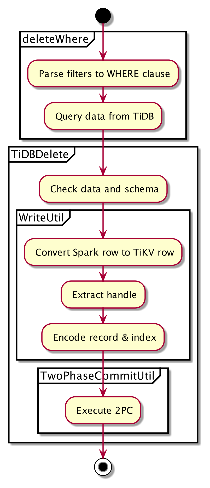
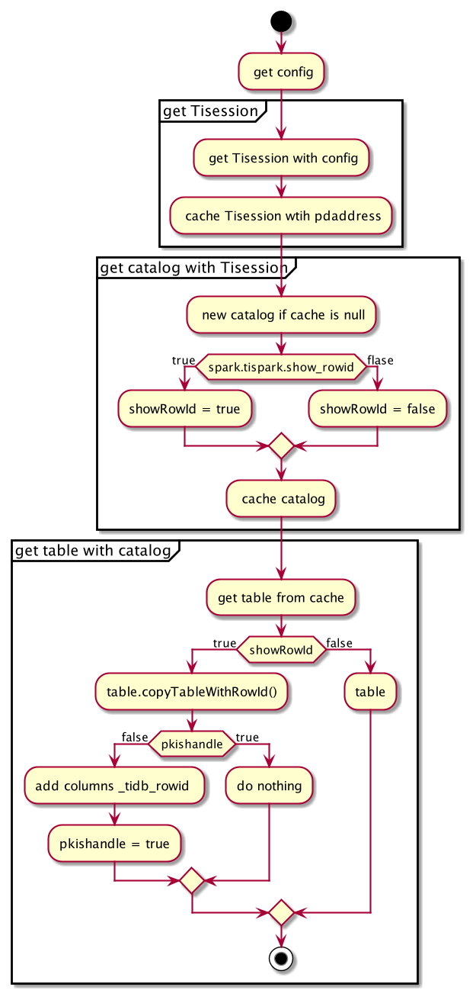

# TiSpark Design Documents

- Author(s): shiyuhang0
- Tracking Issue: https://github.com/pingcap/tispark/issues/2235

## Table of Contents

- [Introduction](#introduction)
- [Motivation or Background](#motivation-or-background)
- [Goals](#goals)
- [API](#api)
- [Detailed Design](#detailed-design)
  * [Parse filters to WHERE clause](#parse-filters-to-where-clause)
  * [Query Data ByPass TiDB](#query-data-bypass-tidb)
  * [Check data and schema](#check-data-and-schema)
  * [Extract handle](#extract-handle)
  * [Encode record & index](#encode-record---index)
  * [2PC](#2pc)
- [Auth Design](#auth-design)
- [Compatibility](#compatibility)
- [Test Design](#test-design)
  * [Functional Tests](#functional-tests)
  * [Compatibility Tests](#compatibility-tests)
  * [Benchmark Tests](#benchmark-tests)
- [References](#references)

## Introduction

New feature: TiSpark Delete Feature

## Motivation or Background

TiSpark is a connector that provides read and write support. However, it lacks the ability to delete. 

Delete operations are becoming more and more important for many big-data workflows. Right now, we are able to provide delete operations after the support of delete in spark 3.0.

## Goals
**Must have**
- Support delete bypass TiDB and provide friendly API with spark SQL
- Compatible with TiDB 4.x and 5.x

**Nice to have**
- Optimize the code in the write feature which can be reused. Because write and delete have similar logic. However, the code in the write is hard to reuse.
- Auth for delete
- User doc

**Not Support**
- Delete without WHERE clause
- Delete with subQuery
- Delete from partition table
- Delete with Pessimistic Transaction Mode
- Update TableStatistics to TiDB

## API
Use spark SQL to execute delete in TiSpark.
```
// delete with spark sql
spark.sql("delete from tidb_catalog.db.table where xxx")
```

## Detailed Design
Here are the main steps:
1. Parse filters to WHERE clause
2. Query data from TiDB
3. Check data and schema
4. Convert Spark row to TiKV row
5. Extract handle from pk or _tidb_rowid.
6. encode record & index to (encodeKey, encodeValue), notice that encodeValue is empty
7. Execute 2PC

<div align="center">

</div>

### Parse filters to WHERE clause
Spark provides the delete API with the filters parameter `void deleteWhere(Filter[] filters)`, so we need to parse it to SQL WHERE clause.

Use pattern matching to parse filter. See the table below for details

| Filter                           | WHERE clause                       |
|----------------------------------|------------------------------------|
| EqualTo(attr, value)             | attr = value                       |
| LessThan(attr, value)            | attr < value                       |
| GreaterThan(attr, value)         | attr > value                       |
| LessThanOrEqual(attr, value)     | attr <= value                      |
| GreaterThanOrEqual(attr, value)  | attr >= value                      |
| IsNull(attr)                     | attr IS NULL                       |
| IsNotNull                        | attr IS NOT NULL                   |
| StringStartsWith(attr, value)    | attr LIKE 'value%'                 |
| StringEndsWith(attr, value)      | attr LIKE '%value'                 |
| StringContains(attr, value)      | attr LIKE '%value%'                |
|  In(attr, value)                 | attr in (value1,value2,value3,...) |
| Not(f)                           | Not f                              |
| Or(f1,f2)                        | f1 OR f2                           |
| And(f1,f2)                       | f1 AND f2                          |

### Query Data ByPass TiDB
Delete operation need to get every row and handle.

We can get the handle in the following way, no matter which TiDB version is

| schema         | handle       |
|----------------|--------------|
| pkIsHandle     | primary key  |
| isCommonHandle | primary key  |
| others         | _tidb_rowid  |

We can get row and pk easily, so I will describe how to get the `_tidb_rowid`.

TiSpark support config `spark.tispark.show_rowid` to get `_tidb_rowid`, then this configuration determines the `showRowId` in Catalog. The logic is as follows

<div align="center">

</div>

It is not acceptable to configure `spark.tispark.show_rowid` in the config file. Because the configuration is global, which will cause all SELECT statements to return with `_tidb_rowid`. 

It also does not work to modify the configuration at runtime for the catalog is cached. We can't change the `showRowId` without clearing the cache, which will affect the performance of TiSpark.

Considering each SQL requires loadTable, we can manually call method copyTableWithRowId when loadTable. This won't affect other SQL and needn't clear the cache. Then, specify when to call copyTableWithRowId. Here are two ways
- Use Spark SQL: The hint is a good choice for SQL, but Spark doesn't provide the extension of hint.
- Use Read API: Add option `（"tidbRowId","true"）`in Read API.

In conclusion, we will use Read API with `tidbRowId` option and then call the `copyTableWithRowId` when the table is loaded.
```
sparkSession.read
  .format("tidb")
  .option("database", databaseName)
  .option("table", tableName)
  .option("tidbRowId","true")
  .load()
  .filter(filterWhereClause)
```  
> The TiDBOption in Read API will block the read. It needs to be removed for is required by write rather than read. 


### Check data and schema
Do the following checks
- Check the WHERE clause, WHERE clause is required in DELETE statement.
- Check if the data is empty.
- Check if the schema matches.

### Extract handle
Extract handle according to the schema

| schema          | How to build handle               |
|-----------------|-----------------------------------|
| isCommonHandle  | Build CommonHandle with pk        |
| pkIsHandle      | Build IntHandle with pk           |
| others          | Build IntHandle with _tidb_rowid  |


### Encode record & index
> Need to refactor the encode logic in write into WriteUtil

Encode record and index into `(key, value)`, so we can insert them into TiKV.

|         | key                                | value           |
|---------|------------------------------------|-----------------|
| record  | tableId + handle                   | Array[Byte] (0) |
| index   | tableId + indexId for every index  | Array[Byte] (0) |

Notice that when we encode the index, we need to exclude the primary key in isCommonHandle. Because we have encoded it when we encode the record.

### 2PC
> Need to refactor the 2PC logic in write into TwoPhaseCommitUtil.

Since we can not pass options through the DELETE statement. The options required by 2PC are using the default value.
1. apply partitioning strategy（this is an optimization, we may do nothing here finally）
2. driver primary pre-write
3. start primary key TTL update
4. executors secondary pre-write
5. driver primary commit
6. stop primary key TTL update
7. executors secondary commit

## Auth Design
DELETE statement need to be authenticated in auth mode.

Users need `SELECT` and `DELETE` privileges to execute the DELETE statement. TiSpark has checked `SELECT` privilege when load table and query from TiDB. So, we just need to check `DELETE` privilege
1. match `DeleteFromTable` in `TiAuthorizationRule` and call auth
2. add `authorizeForDelete` method to check privilege in `TiAuthorization`


## Compatibility

- TiDB support: 4.x and 5.x
- Spark support: >= 3.0

## Test Design


### Functional Tests

- WHERE clause test
- Not support test
- Can not affect other features. For example, SELECT statement after delete should not contain `_tidb_rowid`
- Auth test

### Compatibility Tests

| TiDB version | schema                                   | isCommonHandle  | pkishandle  | _tidb_rowid |
|--------------|------------------------------------------|-----------------|-------------|-------------|
| 5.x          | Cluster index pk (int)                   | false           | true        | no          |
| 5.x          | Cluster index pk（not int）                | true            | false       | no          |
| 5.x          | Non cluster index (int)                  | false           | false       | yes         |
| 5.x          | Non cluster index（not int）               | false           | false       | yes         |
| 5.x          | no pk                                    | false           | false       | yes         |
| 4.x          | pk (int) + alter-primary-key = true      | false           | false       | yes         |
| 4.x          | pk (int) + alter-primary-key = false     | false           | true        | no          |
| 4.x          | pk (not int) + alter-primary-key = true  | false           | false       | yes         |
| 4.x          | pk (not int) + alter-primary-key = false | false           | false       | yes         |
| 4.x          | no pk                                    | false           | false       | yes         |

### Benchmark Tests

Use Sysbench to do benchmark for delete.

## References
- [What's new in Apache Spark 3.0](https://www.waitingforcode.com/apache-spark-sql/what-new-apache-spark-3-delete-update-merge-api-support/read)
- [Iceberg Delete design doc](https://docs.google.com/document/d/1Pk34C3diOfVCRc-sfxfhXZfzvxwum1Odo-6Jj9mwK38/edit#heading=h.e4k1puljgg7w)
- [RDD.deleteFromCasssandra() implementation](https://github.com/datastax/spark-cassandra-connector/pull/1047)