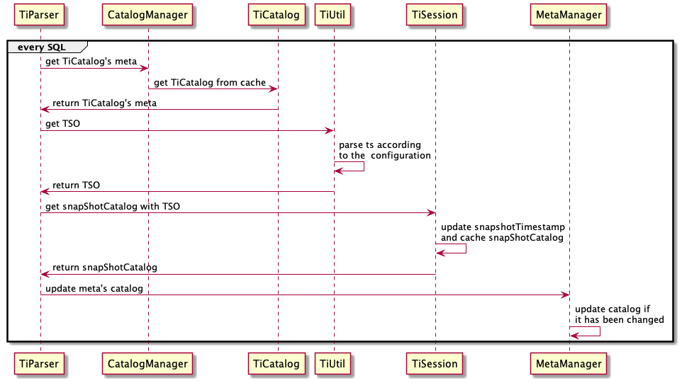

# TiSpark Design Documents

- Author(s): shiyuhang0
- Tracking Issue: https://github.com/pingcap/tispark/issues/2317

## Table of Contents

* [Introduction](#introduction)
* [Motivation or Background](#motivation-or-background)
* [Detailed Design](#detailed-design)
    * [New configuration](#new-configuration)
    * [Step](#step)
    * [Parse timestamp to PD TSO](#parse-timestamp-to-pd-tso)
    * [Update TiCatalog's meta](#update-tiCatalog's-meta)
    * [update start_ts](#update-start_ts)
* [Compatibility](#compatibility)
* [API](#api)
* [Test Design](#test-design)

## Introduction

New feature: TiSpark stale read

## Motivation or Background

Stale read is a mechanism that can read historical versions of data stored in TiKV.

TiDB has provided [stale read](https://docs.pingcap.com/zh/tidb/stable/stale-read). 
- Using stale read, we can read historical data from TiKV
- Using stale read, we can read from TiKV follower to reduce the pressure of leader. Therefore, stale read can improve the query performance.

TiSpark will support stale read after this doc, but it will not read from TiKV follower for TiSpark does not support follower read yet.

## Detailed design

### New configuration
TiSpark support stale read with a new configurations `spark.tispark.stale_read`
- This configurations accept timestamp which is Long type
- This configuration better meet this condition ${now} - ${spark.tispark.stale_read} + ${sql execution time}) < ${GC lifetime} to avoid the historical data be cleared.


### Step
To support stale read, TiSpark need to
1. parse timestamp to PD TSO
2. update TiCatalog's meta to historical meta
3. update start_ts to read historical data

### Parse timestamp to PD TSO
PD TSO is a globally unique time service provided by PD, it consists of physical and logical
- physical: 46 bit, we set physical with timestamp (ms) in stale read
- logical: 18 bit, we set logical with 0 in stale read


### Update TiCatalog's meta
TiSpark use TiCatalog to provide schema to catalyst, TiCatalog's meta contains the TiKV catalog.
- TiCatalog is the Catalog plugin provided by Spark
- TiKV catalog can provide schema with current TSO

TiSpark need schema with specified TSO in stale read. So, we introduce snapShotCatalog to do this and update TiCatalog's meta with snapShotCatalog



### update start_ts
TiSpark will check `spark.tispark.stale_read` in `TiStrategy`, then set start_ts to corresponding TSO if the configurations is valid


## Compatibility
- Stale read only affects Spark-SQL. DataSource API will not be affected, such as `df.write` and `spark.read`.
- Stale read will affect DML(SQL) with the historical schema, So avoid use DML with stale read.

## API

### use with config
- config `spark.tispark.stale_read` in spark-default.conf
- or you can config when you submit application `spark-submit --conf spark.tispark.stale_read="2016-10-08 16:45:26"`
### use with java/scala code
you can config `spark.tispark.tidb_snapshot` with different timestamp before every SQL to read different snapshot

To quit stale read, just config with `spark.conf.unset("spark.tispark.stale_read")` or `spark.conf.set("spark.tispark.stale_read", "")`
```
spark.conf.set("spark.tispark.stale_read", "2022-05-06 00:00:05")
spark.sql("select * from test.t")

spark.conf.set("spark.tispark.stale_read", "2022-05-06 00:00:10")
spark.sql("select * from test.t")

spark.conf.set("spark.tispark.stale_read", "")
spark.sql("select * from test.t")
```

## Test Design
| scenes                         | expected results                 |
| ------------------------------ | -------------------------------- |
| invaild timestamp test         | throw exception                  |
| vaild timestamp test           | read historical data correctly   |
| session level test             | does not affect other sessions   |
| dynamic configuration test     | each SQL takes effect            |
| schema change test             | read historical schema correctly |
| stale read with datasource api | will not affect datasource api   |


