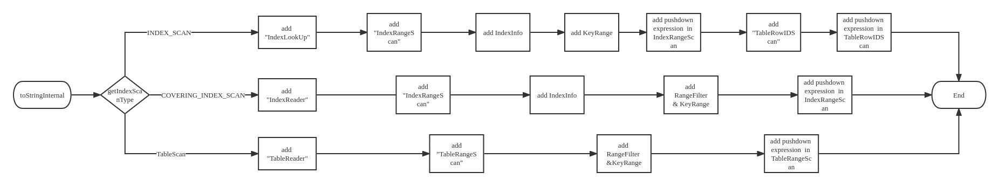

# TiSpark Design Documents

- Author(s): [qidi1](https://github.com/qidi1)
- Tracking Issue: https://github.com/pingcap/tispark/issues/2385

## Table of Contents

- [Introduction](#introduction)
- [Background](#motivation-or-background)
- [Detailed Design](#detailed-design)
- [Test Design](#test-design)

## Introduction

The physical plan is the physical execution plan in TiSpark. When we use `explain` in Spark which runs with TiSpark, the process of the physical plan will be displayed in the terminal. But now this display about how the plan executes has some problems.

- outputting multiple filters which should not show together at the same time.

- unclear representation of the execution process.

- obscure push-down conditions.

The display of the physical plan needs to be improved.

## Background

### The Process of Scan

#### `IndexScan`

In TiSpark, an `IndexScan` requires two scans. One is scanning in index data to get the `RowID` and the other one is scanning in table data to get the real data. The first scan in code is called `IndexScan`, and the second scan in code called `TableScan`, but to facilitate the distinction, in the latter part of the text, the first scan is called `IndexRangeScan`, and the second scan is called `TableRowIDScan`.

#### `CoveringIndexScan`

`CoveringIndexScan` is a special case of `IndexScan`. If the column(s) in Filter and the column(s) in Projection are both inside the Index in one visit, then we only need to scan the Index once, no need to scan for the Table. That is, it only scans for the Index, such a scan is called `CoveringIndexScan`.

#### `TableScan`

`TableScan` is different from `IndexScan` and `CoveringIndexScan`. `TableScan` only scans table data. Such a scan we called `TableRangeScan` in the following.

### Filter Concept

#### `PushDown Filter`

The expression passed to COP([TiKV Coprocessor](https://docs.pingcap.com/tidb/stable/tikv-overview#tikv-coprocessor))/TiKV as Selection without triggering a downgrade.

#### `Downgrade Filter`

`Downgrade Filter` is used after `IndexScan` downgrade.

The first stage of `IndexScan` which we called `IndexRangeScan` will return the `RowID` that meets the conditions, and then TiSpark will sort and aggregate the returned Row IDs to obtain the region that needs to be scanned in the second stage of `IndexScan`——`TableRowIDScan`. After sorting and aggregating we will get the `regionTask` number. If the `regionTask` number is bigger than `downgradeThreshold`, The `TableRowIDScan` in the second will be `TableScan`.  The `StartKey` of `TableRangeScan` is the minimum `RowID` returned by `IndexRangeScan`, and the `EndKey ` of `TableRangeScan` is the minimum `RowID` returned by `IndexRangeScan`. The Filter will become `Downgrade Filter` (`Downgrade Filter` is the same as if the execution plan is `TableScan`'s Filter).

> **`RegionTask`**
>
> For all returned `RowID`, all consecutive `RowID` in a region will be treated as a `RegionTask`.
>
> For example like this the `RowID` returned in the first stage are 1,3,4,5 and 1,3,4 are in the same region and 5 is in another region. Since 1 and 3,4 are not contiguous, 1 is `RegionTask`, and since 3,4 and 5 are not in a region, 3,4 is a `RegionTask` and 5 is another `RegionTask`.The `RegionTask` number will three.

#### `Residual Filter`

In the original design, the `Residual Filter` represents operators that cannot be pushed down to COP/TiKV. However, in the current implementation, before the construction of `DAGRequest`, it will judge whether the operators can be pushed down, and only the operators that can be downscaled will participate in the construction of `DAGRequest`, which means that all the operators in `DAGRequest` can be downscaled to COP/TiKV. The Residual Filter loses its original meaning because there are no operators in `DAGRequest` that cannot be pushed down.

### The Problem of DAG Explain

1. outputting multiple filters which should not show together at the same time

   As shown below, both `Residual Filter` and `PushDown Filter` appear, while for a `TableScan` and `CoveringIndexScan` there should be only `PushDown Filter`.

   ```SQL
   CREATE TABLE `t1` (
     `a` BIGINT(20) UNSIGNED  NOT NULL,
     `b` varchar(255) NOT NULL,
     `c` varchar(255) DEFAULT NULL
   ) ENGINE=InnoDB DEFAULT CHARSET=utf8mb4 COLLATE=utf8mb4_bin"
   ```

   ```sql
   SELECT * FROM t2 where a>1
   ```

   ```Text
   == Physical Plan ==
   *(1) ColumnarToRow
   +- TiKV CoprocessorRDD{[table: t1] TableScan, Columns: a@UNSIGNED LONG, Residual Filter: [a@UNSIGNED LONG GREATER_THAN 1], PushDown Filter: [a@UNSIGNED LONG GREATER_THAN 1], KeyRange: [([t\200\000\000\000\000\000\004W_r\000\000\000\000\000\000\000\000], [t\200\000\000\000\000\000\004W_s\000\000\000\000\000\000\000\000])], Aggregates: , startTs: 433780573880188929}
   ```

   ```sql
   CREATE TABLE `t2` (
     `a` BIGINT(20) UNSIGNED  NOT NULL,
     `b` varchar(255) NOT NULL,
     `c` varchar(255) DEFAULT NULL,
     PRIMARY KEY (a,b)
   ) ENGINE=InnoDB DEFAULT CHARSET=utf8mb4 COLLATE=utf8mb4_bin
   ```

   ```sql
   SELECT a FROM t2 where a>0 and b>'aa'
   ```

   ```
   == Physical Plan ==
   *(1) Project [a#169]
   +- *(1) ColumnarToRow
      +- TiKV CoprocessorRDD{[table: t2] CoveringIndexScan[Index: primary] , Columns: a@UNSIGNED LONG, b@VARCHAR(255), Residual Filter: [b@VARCHAR(255) GREATER_THAN "aa"], PushDown Filter: [b@VARCHAR(255) GREATER_THAN "aa"], KeyRange: [([t\200\000\000\000\000\000\005\234_i\200\000\000\000\000\000\000\001\004\000\000\000\000\000\000\000\001], [t\200\000\000\000\000\000\005\234_i\200\000\000\000\000\000\000\001\372])], startTs: 434097417730654211}
   
   ```

2. unclear representation of the execution process

   For an `IndexScan`, normally the `IndexRangeScan` should be executed first, then the `TableRowIDScan`. Only in the case of triggering a downgrade will the `Downgrade Filter` be executed, but in the physical execution plan, only the Downgrade Filter is shown.

   ```SQL
   CREATE TABLE `t2` (
     `a` BIGINT(20) UNSIGNED  NOT NULL,
     `b` varchar(255) NOT NULL,
     `c` varchar(255) DEFAULT NULL,
     PRIMARY KEY (`a`,`b`)
   ) ENGINE=InnoDB DEFAULT CHARSET=utf8mb4 COLLATE=utf8mb4_bin
   ```

   ```SQL
   SELECT * FROM t2 where a<1 or b>'bb'"
   ```

   ```text
   == Physical Plan ==
   *(1) ColumnarToRow
   +- TiSpark RegionTaskExec{downgradeThreshold=1000000000,downgradeFilter=[[[a@UNSIGNED LONG LESS_THAN 1] OR [b@VARCHAR(255) GREATER_THAN "bb"]]]
      +- RowToColumnar
         +- TiKV FetchHandleRDD{[table: t2] IndexScan[Index: primary] , Columns: a@UNSIGNED LONG, b@VARCHAR(255), c@VARCHAR(255), Downgrade Filter: [[a@UNSIGNED LONG LESS_THAN 1] OR [b@VARCHAR(255) GREATER_THAN "bb"]], PushDown Filter: [[a@UNSIGNED LONG LESS_THAN 1] OR [b@VARCHAR(255) GREATER_THAN "bb"]], KeyRange: [([t\200\000\000\000\000\000\003\374_i\200\000\000\000\000\000\000\001\000], [t\200\000\000\000\000\000\003\374_i\200\000\000\000\000\000\000\001\372])], Aggregates: , startTs: 433735624236728323}
   ```

3. obscure push-down conditions

   As shown below, for the query condition a>0 is pushed down, but the pushed-down information is only implicitly given inside the `KeyRange`, which is not convenient for users to understand.

   ```SQL
   CREATE TABLE `t3` (
     `a` BIGINT(20) NOT NULL,
     `b` varchar(255) NOT NULL,
     `c` varchar(255) DEFAULT NULL,
     PRIMARY KEY (`a`) clustered
   ) ENGINE=InnoDB DEFAULT CHARSET=utf8mb4 COLLATE=utf8mb4_bin
   ```

   ```SQL
   SELECT a FROM t3 where a>0
   ```

   ```text
   == Physical Plan ==
   *(1) ColumnarToRow
   +- TiKV CoprocessorRDD{[table: t3] TableScan, Columns: a@LONG, KeyRange: [([t\200\000\000\000\000\000\005/_r\200\000\000\000\000\000\000\001], [t\200\000\000\000\000\000\005/_s\000\000\000\000\000\000\000\000])], startTs: 434063568626778113}
   ```

## Detailed Design

### Design Overview

- **`TableRangeScan`**: Table scans with the specified range. We consider full table scan as a special case of `TableRangeScan`, so full table scan is also called `TableRangeScan`.

- **`TableRowIDScan`**: Scans the table data based on the `RowID`. Usually follows an index read operation to retrieve the matching data rows.

- **`IndexRangeScan`**: Index scans with the specified range. We consider full index scan as a special case of `IndexRangeScan`, so full index scan is also called `IndexRangeScan`.

- **`RangeFilter`**: `RangeFilter` indicates which conditions the range is made up of. `RangeFilter` generally appears when the query involves an index. If `RangeFilter` is empty, it indicates a full table scan or full index scan. `RangeFilter` generally appears when the query involves an index range, when query the expressions in the `RangeFilter` form the scanned range from left to right.

  > **Which expression will be appeared in `RangeFilter`**
  >
  > 1. iterate through all the columns in the Index from left to right.
  > 2. If there is an Expression related to the column in Expression and the Expression is dot-checked, add that `Expression` to `RangeFilter`. Go back to step 1.
  > 3. If there is an Expression related to the column in the Expression and the Expression is a range, add the `Expression` to the `RangeFilter` and exit.
  > 4. If there is no Expression related to the column in the Expression; exit. Output we expect
  >
  > For example:
  >
  > ```sql
  > CREATE TABLE `t1` (
  >   `a` BIGINT(20)  NOT NULL,
  >   `b` varchar(255) NOT NULL,
  >   `c` varchar(255) DEFAULT NULL,
  >   PRIMARY KEY (`a`,`b`)
  > ) ENGINE=InnoDB DEFAULT CHARSET=utf8mb4 COLLATE=utf8mb4_bin
  > CREATE TABLE `t2` (
  >   `a` BIGINT(20)  NOT NULL,
  >   `b` varchar(255) NOT NULL,
  >   `c` varchar(255) DEFAULT NULL,
  >   PRIMARY KEY (`b`,`a`)
  > ) ENGINE=InnoDB DEFAULT CHARSET=utf8mb4 COLLATE=utf8mb4_bin
  > ```
  >
  > If we execute:
  >
  > ```sql
  > SELECT t1.a FROM t1 WHERE t1.a = 0 and t1.b>'aa'
  > ```
  >
  > Because the primary key of `t1` has `a` in the front and `b` in the back, we can use these two conditions to build a scan range. The `RangeFilter` is `{a=0,b>'aa'}`, the constructed scan range is `(tid_i_a=0_b='aa', tid_i_a_inf)`.
  >
  > If we execute:
  >
  > ```sql
  > SELECT t1.a FROM t1 WHERE t1.b>'aa'
  > ```
  >
  > Because the primary key of `t1` has a in the front and b in the back, we can't use `b>'aa'` to build the range of the query.  The `RangeFilter` is empty, The scan range is `(tid_i_-inf,tid_i_+inf)`.
  >
  > If we execute:
  >
  > ```sql
  > SELECT t2.a FROM t2 WHERE t2.a = 0 and t2.b>'aa'
  > ```
  >
  > Because the primary key of `t2` has `b` in the front and `a` in the back, we can use this `b>'aa'` to build a scan range. The `RangeFilter` is `{b>'aa'}`, and the scan range is constructed as `(tid_i_b='aa', tid_i_inf)`.
  >
  > ### 

#### Problem in `TableScan`&`CoveringIndexScan`

In `TableScan` & `CoveringIndexScan`, there are two problems.

1. outputting multiple filters which should not show together at the same time
2. obscure push-down conditions

For problem outputting multiple filters which should not show together at the same time that happended in `TableScan` and `CoveringIndexScan`, we remove `Residual Filter` and rename `PushDown Filter` to `Selection`.

For problem obscure push-down conditions, we add `RangeFilter` for `KeyRange`.

##### `Table Scan`

- Add `TableRangeScan`.
- Remove `Residual Filter`.
- Renamed `PushDown Filter` to `Selection`.
- Add `RangeFliter` indicating which conditions are used to build Range.

```sql
CREATE TABLE `t1` (
  `a` BIGINT(20) NOT NULL,
  `b` varchar(255) NOT NULL,
  `c` varchar(255) DEFAULT NULL
) ENGINE=InnoDB DEFAULT CHARSET=utf8mb4 COLLATE=utf8mb4_bin
```

```sql
SELECT * FROM t1 where a>0
```

**Before:**

```text
== Physical Plan ==
*(1) ColumnarToRow
+- TiKV CoprocessorRDD{[table: t1] TableScan, Columns: a@LONG, b@VARCHAR(255), c@VARCHAR(255), Residual Filter: [a@LONG GREATER_THAN 0], PushDown Filter: [a@LONG GREATER_THAN 0], KeyRange: [([t\200\000\000\000\000\000\002\376_r\000\000\000\000\000\000\000\000], [t\200\000\000\000\000\000\002\376_s\000\000\000\000\000\000\000\000])], startTs: 433995142104612867}
```

**After:**

```text
= Physical Plan ==
*(1) ColumnarToRow
+- TiKV CoprocessorRDD{[table: t1] TableScan, Columns: a@LONG, b@VARCHAR(255), c@VARCHAR(255): { TableRangeScan: { KeyRange: { RangeFilter: {}, Range: [([t\200\000\000\000\000\000\003A_r\000\000\000\000\000\000\000\000], [t\200\000\000\000\000\000\003A_s\000\000\000\000\000\000\000\000])], Selection: [a@LONG GREATER_THAN 0] } }, startTs: 433995460281892865}
```

```sql
CREATE TABLE `t3` (
  `a` BIGINT(20) NOT NULL,
  `b` varchar(255) NOT NULL,
  `c` varchar(255) DEFAULT NULL,
  PRIMARY KEY (a) clustered
) ENGINE=InnoDB DEFAULT CHARSET=utf8mb4 COLLATE=utf8mb4_bin
```

```sql
SELECT * FROM t3 where a>0
```

**Before:**

```text
== Physical Plan ==
*(1) ColumnarToRow
+- TiKV CoprocessorRDD{[table: t3] TableScan, Columns: a@LONG, b@VARCHAR(255), c@VARCHAR(255), KeyRange: [([t\200\000\000\000\000\000\003\022_r\200\000\000\000\000\000\000\001], [t\200\000\000\000\000\000\003\022_s\000\000\000\000\000\000\000\000])], startTs: 433995273490923521}
```

**After:**

```text
== Physical Plan ==
*(1) ColumnarToRow
+- TiKV CoprocessorRDD{[table: t3] TableScan, Columns: a@LONG, b@VARCHAR(255), c@VARCHAR(255): { TableRangeScan: { KeyRange: { RangeFilter: {[a@LONG GREATER_THAN 0]}, Range: [([t\200\000\000\000\000\000\003U_r\200\000\000\000\000\000\000\001], [t\200\000\000\000\000\000\003U_s\000\000\000\000\000\000\000\000])] } }, startTs: 433995476849393665}
```

##### `CoveringIndexScan`

- Remove `Residual Filter`.
- Rename `PushDown Filter` to Selection.
- Add the description information of the index used in the scan.
- Add `RangeFilter` to indicate which conditions are used to build Range.

```sql
CREATE TABLE `t2` (
  `a` BIGINT(20) UNSIGNED  NOT NULL,
  `b` varchar(255) NOT NULL,
  `c` varchar(255) DEFAULT NULL,
  PRIMARY KEY (`a`,`b`)
) ENGINE=InnoDB DEFAULT CHARSET=utf8mb4 COLLATE=utf8mb4_bin
```

```sql
SELECT a,b FROM t2 where a>0 and b>'aa'
```

**Before:**

```text
== Physical Plan ==
*(1) ColumnarToRow
+- TiKV CoprocessorRDD{[table: t2] CoveringIndexScan[Index: primary] , Columns: a@LONG, b@VARCHAR(255), Residual Filter: [b@VARCHAR(255) GREATER_THAN "aa"], PushDown Filter: [b@VARCHAR(255) GREATER_THAN "aa"], KeyRange: [([t\200\000\000\000\000\000\0033_i\200\000\000\000\000\000\000\001\003\200\000\000\000\000\000\000\001], [t\200\000\000\000\000\000\0033_i\200\000\000\000\000\000\000\001\372])], startTs: 433995356695429121}
```

**After:**

```text
== Physical Plan ==
*(1) ColumnarToRow
+- TiKV CoprocessorRDD{[table: t2] CoveringIndexScan, Columns: a@LONG, b@VARCHAR(255): { IndexRangeScan: [Index: primary (a,b)]: { KeyRange: { RangeFilter: {[a@LONG GREATER_THAN 0]}, Range: [([t\200\000\000\000\000\000\003\223_i\200\000\000\000\000\000\000\001\003\200\000\000\000\000\000\000\001], [t\200\000\000\000\000\000\003\223_i\200\000\000\000\000\000\000\001\372])], Selection: [b@VARCHAR(255) GREATER_THAN "aa"] } }, startTs: 433995598326923265}
```

#### Problem in `IndexScan`

In `IndexScan`, there are two problems.

1. unclear representation of the execution process
2. obscure push-down conditions

For problem unclear representation of the execution process that happened in `IndexScan`, we retain the `Downgrade Filter` on `RegionTaskExec` . and refine the output `IndexScan` of `FetchHandleRDD`  to `IndexRangeScan` and `TableRowIDScan`, indicating that after the `IndexScan` there is a `TableScan` for the `RowID` is scanned after `IndexScan`, and delete the original `Downgrade Filter` in `FetchHandleRDD`. Add `Selection` `FetchHandleRDD` in to indicate the `Selection` condition executed in the normal execution process.

For problem obscure push-down conditions, we add `RangeFilter` for `KeyRange`.

##### `IndexScan`

- Fixed the bug that the output of `Downgrade Filter` in `FetchHandleRDD` is actually `PushDown Filter`.
- The output `IndexScan` of `FetchHandleRDD` is further refined to `IndexRangeScan` and `TableRowIDScan`, indicating that after the `IndexScan` there is a `TableScan` for the `RowID` is scanned after `IndexScan`.
- Delete the original `Downgrade Filter` in `FetchHandleRDD`. Add `Selection` `FetchHandleRDD` in to indicate the `Selection` condition executed in the normal execution process.
- Add the description information of the index used in the scan.
- Add `RangeFilter` in Range, indicating which conditions are used to build Range.

``` sql
CREATE TABLE `t2` (
  `a` BIGINT(20) NOT NULL,
  `b` varchar(255) NOT NULL,
  `c` varchar(255) DEFAULT NULL,
  PRIMARY KEY (`a`)
) ENGINE=InnoDB DEFAULT CHARSET=utf8mb4 COLLATE=utf8mb4_bin
```

```SQL
SELECT * FROM t2 where a>0
```

**Before:**

```text
== Physical Plan ==
*(1) ColumnarToRow
+- TiSpark RegionTaskExec{downgradeThreshold=1000000000,downgradeFilter=[]
   +- RowToColumnar
      +- TiKV FetchHandleRDD{[table: t2] IndexScan[Index: primary] , Columns: a@LONG, b@VARCHAR(255), c@VARCHAR(255), Downgrade Filter: [a@LONG GREATER_THAN 0], KeyRange: [([t\200\000\000\000\000\000\003 _i\200\000\000\000\000\000\000\001\003\200\000\000\000\000\000\000\001], [t\200\000\000\000\000\000\003 _i\200\000\000\000\000\000\000\001\372])], startTs: 433995306940497921}
```

**After:**

```text
== Physical Plan ==
*(1) ColumnarToRow
+- TiSpark RegionTaskExec{downgradeThreshold=1000000000,downgradeFilter=[[a@UNSIGNED LONG GREATER_THAN 0]]
   +- RowToColumnar
      +- TiKV FetchHandleRDD{[table: t2] IndexScan, Columns: a@UNSIGNED LONG, b@VARCHAR(255), c@VARCHAR(255): { IndexRangeScan: [Index: primary (a)]: { KeyRange: { RangeFilter: {[a@UNSIGNED LONG GREATER_THAN 0]}, Range: [([t\200\000\000\000\000\000\006\322_i\200\000\000\000\000\000\000\001\004\000\000\000\000\000\000\000\001], [t\200\000\000\000\000\000\006\322_i\200\000\000\000\000\000\000\001\372])] }, TableRowIDScan:{  } }, startTs: 434100730234142721}
```

### Code Design



1. We first determine the type of Scan, and here we will classify the Scan into three types

    - Scan on Index first, then on Table, called `IndexScan`.

    - Scan only for Index, called `CoveringIndexScan`.

    - Scan for Table only, called `TableScan`.

   For Scan type, `CoveringIndexScan` and `IndexScan` set `isIndexScan` to true.

   ```java
    switch (getIndexScanType()) {
      case INDEX_SCAN:
        sb.append("IndexScan");
        isIndexScan = true;
        break;
      case COVERING_INDEX_SCAN:
        sb.append("CoveringIndexScan");
        isIndexScan = true;
        break;
      case TABLE_SCAN:
        sb.append("TableScan");
    }
   ```

2. Get the columns in projection and predicates.

   ```java
    if (!getFields().isEmpty()) {
         sb.append(", Columns: ");
         Joiner.on(", ").skipNulls().appendTo(sb, getFields());
       }
   ```

3. Handled separately according to whether `isIndexScan` is true or not.

   ```java
      if (isIndexScan) {
        sb.append(stringIndexScan());
      } else {
        sb.append(stringTableScan());
      }
   ```

    - `stringTableScan`

      Call `buildTableScan`, then call `toPhysicalPlan`.

      ```java
         sb.append("TableRangeScan");
         sb.append(": {");
         TiDAGRequest tableRangeScan = this.copy();
         tableRangeScan.buildTableScan();
         sb.append(tableRangeScan.stringPushDownExpression());
      ```

    - `stringIndexScan`

        - First process `IndexRangeScan`, add the information of index scanned by `IndexRangeScan`, call `buildIndexScan`, then call `toPhysicalPlan`.
        - if it is `DoubleRead`, add `TableRowIDScan`. first call `buildTableScan`, then call `toPhysicalPlan`.

      ```java
          sb.append("IndexRangeScan: ");
          sb.append(index.colNames);
          ...
          TiDAGRequest indexRangeScan = this.copy();
          indexRangeScan.buildIndexScan();
          sb.append(indexRangeScan.stringPushDownExpression());
          if (isDoubleRead()) {
            sb.append(", TableRowIDScan:");
            TiDAGRequest tableRowIDScan = this.copy();
            tableRowIDScan.resetRanges();
            tableRowIDScan.buildTableScan();
            sb.append(tableRowIDScan.stringPushDownExpression());
          }
      ```

    - `stringPushDownExpression`

      Return `Range`, `Filters`, `Aggregates`, `GroupBy`, `OrderBy`, `Limit` to String.

      ```java
      if (!getRangesMaps().isEmpty()) {
           sb.append(getRangeFliter())
           sb.append(getRangesMaps())
      }
      if (!getPushDownFilters().isEmpty()) {
          sb.append(getPushDownFilters())
      }
      if(!getPushDownAggregates().isEmpty()){
          sb.append(getPushDownAggregates())
      }
      if (!getGroupByItems().isEmpty()) {
           sb.append(getGroupByItems())
      }
      if (!getOrderByItems().isEmpty()) {
          sb.append(getOrderByItems())
      }
      if (getLimit() != 0) {
          sb.append(getLimit())
      }
      ```

## Test Design

1. Table without cluster index

   ```SQL
   CREATE TABLE `t1` (
     `a` BIGINT(20) NOT NULL,
     `b` varchar(255) NOT NULL,
     `c` varchar(255) DEFAULT NULL
   ) ENGINE=InnoDB DEFAULT CHARSET=utf8mb4 COLLATE=utf8mb4_bin
   ```

    - `TableScan` with selection and without `RangeFilter`

      ```sql
      SELECT * FROM t1 where a>0 and b > 'aa'
      ```

2. Table with cluster index

   TiDB Version smaller than 5.0

   ```sql
   CREATE TABLE `t1` (
     `a` BIGINT(20) NOT NULL,
     `b` varchar(255) NOT NULL,
     `c` varchar(255) DEFAULT NULL,
     PRIMARY KEY (`a`) 
   ) ENGINE=InnoDB DEFAULT CHARSET=utf8mb4 COLLATE=utf8mb4_bin
   ```

   TiDB Version bigger than 5.0

   ```sql
   CREATE TABLE `t1` (
     `a` BIGINT(20) NOT NULL,
     `b` varchar(255) NOT NULL,
     `c` varchar(255) DEFAULT NULL,
     PRIMARY KEY (`a`) clustered
   ) ENGINE=InnoDB DEFAULT CHARSET=utf8mb4 COLLATE=utf8mb4_bin
   ```

    - `TableScan` with selection and with `RangeFilter`

      ```sql
      SELECT * FROM t1 where a>0 and b > 'aa'
      ```

    - `TableScan` without selection and with `RangeFilter`

      ```sql
      SELECT * FROM t1 where a>0
      ```

3. Table with cluster index and partition

   ```sql
   CREATE TABLE `t1` (
     `a` BIGINT(20) NOT NULL,
     `b` varchar(255) NOT NULL,
     `c` varchar(255) DEFAULT NULL,
     PRIMARY KEY (a)
   )PARTITION BY RANGE (a) (
       PARTITION p0 VALUES LESS THAN (6),
       PARTITION p1 VALUES LESS THAN (11),
       PARTITION p2 VALUES LESS THAN (16),
       PARTITION p3 VALUES LESS THAN MAXVALUE
     )
   ```

    - `TableScan` with Selection and with `RangeFilter` with partition

      ```sql
      SELECT a,b FROM t1 where a>0 and b>'aa'
      ```

4. Table with secondary index

   ```sql
   CREATE TABLE `t1` (
   `a` BIGINT(20)  NOT NULL,
   `b` varchar(255) NOT NULL,
   `c` varchar(255) DEFAULT NULL,
   ) ENGINE=InnoDB DEFAULT CHARSET=utf8mb4 COLLATE=utf8mb4_bin
   CREATE INDEX `testIndex` ON `t1` (`a`,`b`);
   ```

    - `IndexScan` with Selection and with `RangeFilter`

      ```sql
      SELECT * FROM t1 where a>0 and b > 'aa'
      ```

    - `IndexScan` without Selection and with `RangeFilter`

      ```sql
      SELECT * FROM t1 where a=0 and b > 'aa'
      ```

    - `CoveringIndex` with Selection and with `RangeFilter`

      ```sql
      SELECT a,b FROM t1 where a>0 and b > 'aa'
      ```

5. Table with secondary prefix index

   ```sql
   CREATE TABLE `t1` (
   `a` BIGINT(20)   NOT NULL,
   `b` varchar(255) NOT NULL,
   `c` varchar(255) DEFAULT NULL,
   ) ENGINE=InnoDB DEFAULT CHARSET=utf8mb4 COLLATE=utf8mb4_bin
   CREATE INDEX `testIndex` ON `t1` (`b`(4),a);
   ```

    - `IndexScan` with `RangeFilter` and with Selection

      ```sql
      SELECT * FROM t1 where a>0 and b > 'aa'
      ```

    - `IndexScan` with `RangeFilter` and without Selection

      ```sql
      SELECT * FROM t1 where b > 'aa'
      ```

    - `CoveringIndexScan` with `RangeFilter` and with Selection

      ```sql
      SELECT * FROM t1 where a>0 and b > 'aa'
      ```

    - `CoveringIndexScan` with `RangeFilter` and without Selection

      ```sql
      SELECT * FROM t1 where b > 'aa'
      ```

6. Table with secondary index and partition

   ```sql
   CREATE TABLE `t1` (
     `a` BIGINT(20) NOT NULL,
     `b` varchar(255) NOT NULL,
     `c` varchar(255) DEFAULT NULL,
     PRIMARY KEY (a)
   )PARTITION BY RANGE (a) (
       PARTITION p0 VALUES LESS THAN (6),
       PARTITION p1 VALUES LESS THAN (11),
       PARTITION p2 VALUES LESS THAN (16),
       PARTITION p3 VALUES LESS THAN MAXVALUE
     )
   CREATE INDEX `testIndex` ON `t1` (`b`);
   ```

    - `IndexScan` with Selection and with `RangeFilter` with partition

      ```sql
      SELECT * FROM t1 where a>0 and b > 'aa'
      ```

    - `CoveringIndexScan` with Selection and with `RangeFilter` with partition

      ```sql
      SELECT a,b FROM t1 where a>0 and b > 'aa'
      ```

7. Table with secondary prefix index and partition

   ```sql
   CREATE TABLE `t1` (
     `a` BIGINT(20) NOT NULL,
     `b` varchar(255) NOT NULL,
     `c` varchar(255) DEFAULT NULL,
     PRIMARY KEY (a)
   )PARTITION BY RANGE (a) (
       PARTITION p0 VALUES LESS THAN (6),
       PARTITION p1 VALUES LESS THAN (11),
       PARTITION p2 VALUES LESS THAN (16),
       PARTITION p3 VALUES LESS THAN MAXVALUE
     )
   CREATE INDEX `testIndex` ON `t1` (`b`(4));
   ```

    - `IndexScan` with Selection and with `RangeFilter` with partition

      ```sql
      SELECT * FROM t1 where a>0 and b > 'aa'
      ```

    - `CoveringIndexScan` with Selection and with `RangeFilter` with partition

      ```sql
      SELECT a,b FROM t1 where a>0 and b > 'aa'
      ```
