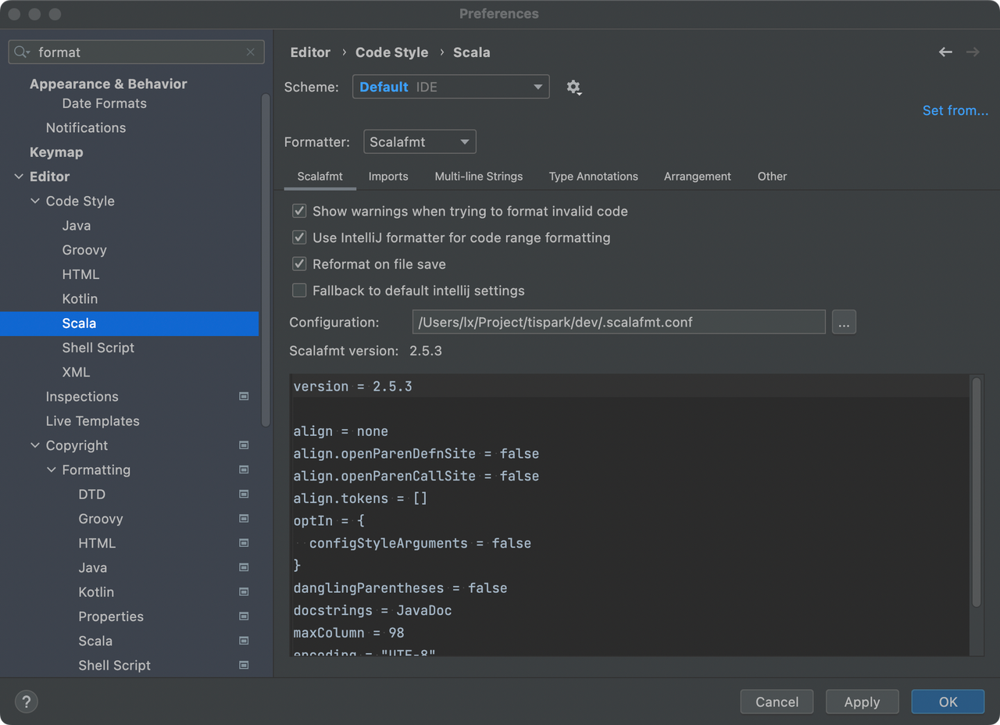
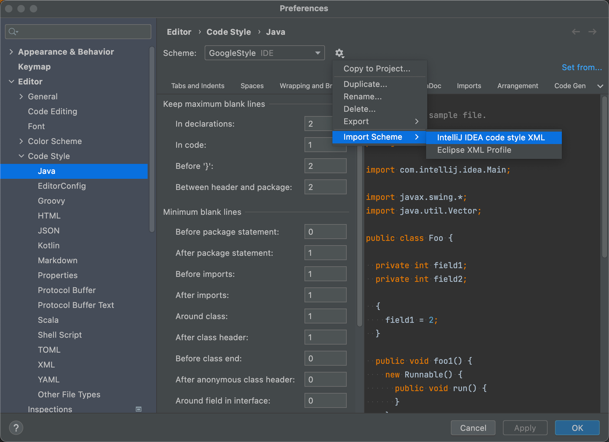

# Code Style

We have strict code style requirements. 
If your code doesn't meet the requirements, it will not be allowed to be merged.

TiSpark uses two languages, Java and Scala.
We have format files for the respective languages and added format operations in Maven. 
So, you have two ways to make your code conform to code style.

## Add format files in IDEA
The format files are under `dev/` called `.scalafmt.conf` and `intellij-java-google-style.xml`.

You can set the Configuration to `.scalafmt.conf` as follows to enable Scala format check in IDEA.

You can import settings in `intellij-java-google-style.xml` as follows to enable Java format check in IDEA.

Once you have completed the above settings, you can use shortcut keys to format in IDEA to make your code conform to code style.

## Use maven to format
We have also added format support in the Maven plugin. 
Before submitting the code, you can run the following commands to format to ensure that your code conforms to the code style.
```
mvn mvn-scalafmt_2.12:format -Dscalafmt.skip=false // For Scala    
mvn com.coveo:fmt-maven-plugin:format // For Java
```