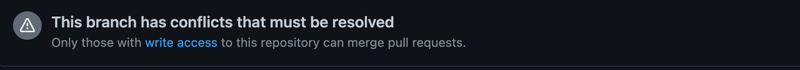

# Commit the code and submit a pull request
TiSpark uses [Git](https://git-scm.com/) to manage its source code. To contribute to the project, you need to get familiar with Git features so that your changes can be incorporated into the codebase.
This section addresses some of the most common questions and problems that new contributors might face. This section also covers some Git basics; however, if you find that the content is a little difficult to understand, we recommend that you first read the following introductions to Git:
- The "Beginner" and "Getting Started" sections of this tutorial from [Atlassian](https://www.atlassian.com/git/tutorials)
- [Documentation](https://docs.github.com/en/get-started/quickstart/set-up-git) and [guides](https://docs.github.com/cn/get-started/using-git/about-git) for beginners from Github
- A more in-depth [book](https://git-scm.com/book/en/v2/) from Git

## Fork from TiSpark
First of all, you need to have your own copy of TiSpark. Just click Fork button to get it.


## Clone to your workspace
After get your own copy of TiSpark, you need to clone the code to your local workspace.
You can clone your copy using `git clone` and use `git remote add`to add the upstream repo,
so that you can pull the latest code in the upstream master branch to reduce the conflict.
```
git clone git@github.com:${YOUR_GITHUB_NAME}/tispark.git

cd tispark

git remote add upstream git@github.pingcap/tispark.git
```

## Create your branch
A good way to keep your workspace away from each other is using branch. 
You can create a new branch using the following command.
```
git checkout -b my-branch
```

## Commit your change
After finishing coding for your change, you should make a commit and write a brief comment about it.
Then, you need to push the change to your own fork.
Use `git push` with `-u` can relate origin branch and local branch, so you can use `git push` for the next pushes.
```
git add ${changed files}

git commit -m 'comment'

git push -u origin my-branch
```

## Submit a pull request
Once committed your change, you can go back to TiSpark and create a pull request by clicking one of the buttons in the following picture.

We have a template for pull request . Please follow the guide and fill it.


## Conflict
There may be a conflict when you submit a pull request since others may change the same code as yours. Git can't handle it automatically, you need to do it yourself. If you are not sure about how to handle it, feel free to ask reviewers for help.


## Review

Ask the reviewer to review your code. If there is a problem, you need to modify it and push it again. The reviewer will review it again until it is approved.

## merged

After you passed all the GitHub action and no review comments left, your code will be merged into the master branch. 
