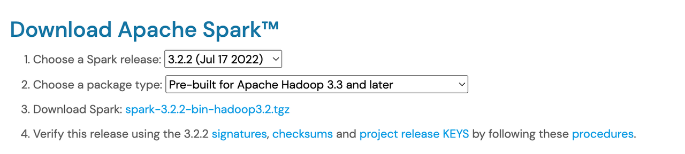

# Install Scala && Java && Spark && Maven
TiSpark is connector for Spark that enables you to use TiDB as the data source of Apache Spark, similar to other data sources.  Therefore, we need to install Scala and Spark. Our client for TiKV is written in Java, so we also need to install Java.
## Install Scala 2.12
We are now using Scala 2.12 . You can find out how to install Scala at  Scala 2.12.16.
We will introduce how to install Scala on MacOs or Unix systems in the following.
1. Download Scala 2.12

   ` curl -O https://downloads.lightbend.com/scala/2.12.16/scala-2.12.16.tgz`
2. Unzip download file

   `tar -zxvf scala-2.12.16.tgz`
3. Set environmental variables
   Edit ${your_shell_profile}  and append following to it. Note: replace {$YOUR_PATH} with your real path.
   ```
   export SCALA_HOME={$YOUR_PATH}/scala-2.12.16
   export PATH=$SCALA_HOME/bin:$PATH
   ```
## Install Java 8
   We are using Java 8 now. You can get Java at Java SE 8u211 and later. If you are using MacOS for M1, Zulu JDK may be a choice for you.
   We take JDK for Linux x64 Compressed Archive for example.
1. Download JDK 8
   Oracle JDK 8 can only be downloaded at its official website, which needs an account.
2. Unzip download file

   `tar -zxvf jdk-8u333-linux-x64.tar.gz`
3. Set environmental variables
   Edit ${your_shell_profile}  and append following to it. Note: replace {$YOUR_PATH} with your real path.
   ```
   export JAVA_HOME={$YOUR_PATH}/jdk-8u333-linux-x64
   export PATH=$JAVA_HOME/bin:$PATH
   ```
## Install Maven
   We use Maven to do project management. You can download the most recently released Maven or history version from here. Just make sure it supports JDK 8.
   We will take Maven 3.8.6 for example.
1. Download Maven
   
   `curl -O https://dlcdn.apache.org/maven/maven-3/3.8.6/binaries/apache-maven-3.8.6-bin.tar.gz`
2. Unzip download file
   
   `tar -zxvf apache-maven-3.8.6-bin.tar.gz`
3. Set environmental variables
   Edit ${your_shell_profile}  and append following to it. Note: replace {$YOUR_PATH} with your real path. And you need to make sure you have installed Java.
   ```
   export MAVEN_HOME={$YOUR_PATH}/apache-maven-3.8.6
   export PATH=$MAVEN_HOME/bin:$PATH
   ```
## Install Spark (only for running jar)
   We support Spark 3.0, 3.1 and 3.2 in TiSpark 3.0.x. You can get Spark at Downloads | Apache Spark.
   We will take Spark 3.2.2 for example.
1. Download Spark
   If you want download it from the website, please follow these choices.
   
   Or you can download using curl

   `curl -O https://dlcdn.apache.org/spark/spark-3.2.2/spark-3.2.2-bin-hadoop3.2.tgz`
2. Unzip download file
   
   `tar -zxvf spark-3.2.2-bin-hadoop3.2.tgz`
3. Set environmental variables
   Edit ${your_shell_profile}  and append following to it. Note: replace {$YOUR_PATH} with your real path.
   ```
   export SPARK_HOME={$YOUR_PATH}/spark-3.2.2-bin-hadoop3.2
   export PATH=$SPARK_HOME/bin:$PATH
   ```