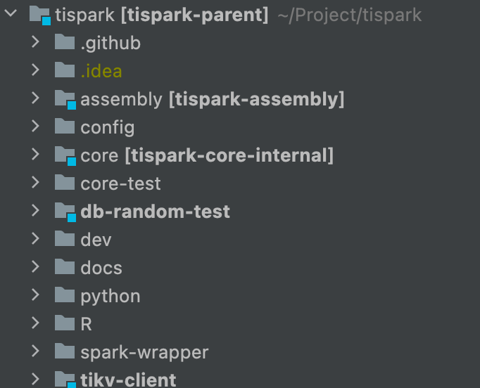

# Overview
This chapter will briefly introduce the project structure of TiSpark and the functions that each module is responsible for.
The structure of TiSpark as shown in the picture below.
Please ignore `.github` and `.idea`.
 

## Assembly
TiSpark depends on multiple modules, so we integrate the compilation results of other modules in this module,
and finally get the jar of TiSpark. If the compilation is done, you will find a jar file under `target` which is named `tispark-assembly-${spark_version}_${scala_version}-${tispark_version}-SNAPSHOT.jar`
## Config
Since TiSpark needs to use TiDB, TiKV and PD, the configuration templates of related components are stored in this directory.
In addition, in order to support security feature, files related to security certificates are also stored in this directory.
## Core
TiSpark stores data in TiKV and uses Spark as computing software. 
We implement some interfaces of Spark to use our code and logic in Spark's processing flow. Under this module are the modifications we made to Spark, which is the core module of this project.
Including but not limited to writing, deleting, authentication, etc.
## Core-Test
We will run integration tests for each pull request.
This directory is normally empty, but when running integration tests, the test codes are copied into this directory. 
You don't need and shouldn't modify this directory.
## DB-random-test
In our tests, we have some special tests that need to use randomly generated data and schemas.
The function of this module is to generate them.
## Dev
This directory is going to store some development-related tools or files.
Currently, there are only format files in this directory.
## Docs
This directory mainly stores some documents, including but not limited to design documents, user documents and development documents.
## Python
Spark provides python API for developers. TiSpark uses pyspark to provide users with Python API too,
and the related codes are in this directory.
# R
## Spark-Wrapper
Spark is still evolving. In different versions, the interface of many components will change.
To support different versions of Spark, we have written separate codes of changed interface for each version of Spark.
These codes are stored in this directory.
## TiKV-Client
TiSpark hopes to bypass TiDB and use Spark as the computing layer. 
However, our data is still stored in TiKV, so we need to be able to read and write to TiKV.
This module writes a client for TiKV in Java, so that the core module can easily read and write data.