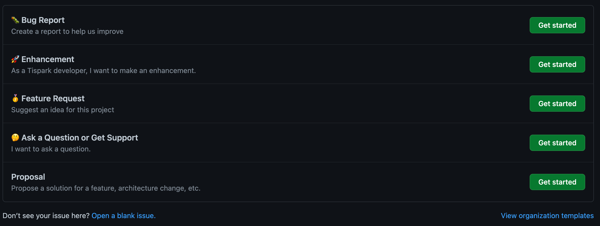
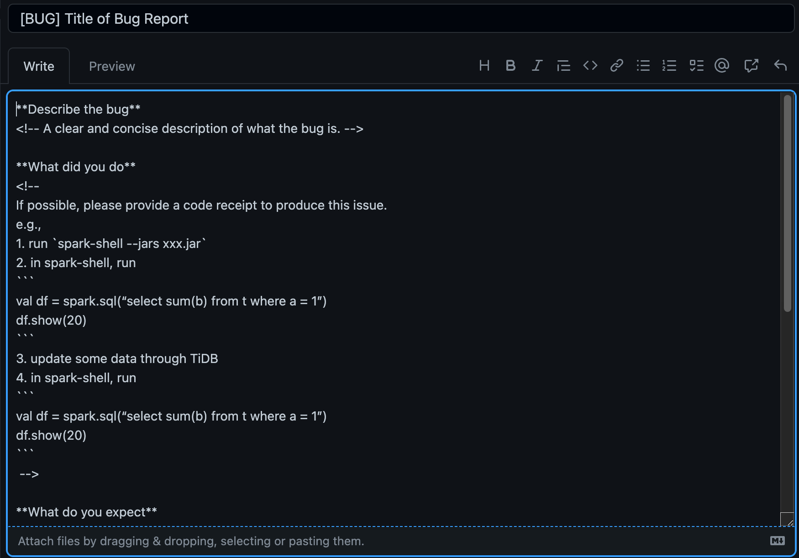

# Report an Issue
If you encounter problems in using TiSpark, think that some functions are missing or find a bug, then you can report it to issue tracker.  
This section is going to guide you on how to make a good issue.

## Checking if an issue already exists
The first step before filing an issue report is to see whether the problem has already been reported.
There are quite a few issues that have been solved in the issue history, some of which may be the problems you meet.
If you can solve your problems through the history, it will be the best way. 
But Github's issue search is not accurate, so feel free to report your issue if you can't get any useful information in the history.

## Choose an issue type
The issue of TiSpark consists of five types, they are bug, enhancement, feature request, proposal and question.
If you want to report a new issue, you will come to this page. Please choose the right type according to your needs.
- Bug: If you encounter a bug when using or developing TiSpark, you can choose it.
- Enhancement: If a feature doesn't meet your expectations, you can choose it
- Feature Request: If you think a feature is missing when using TiSpark, you can choose it.
- Ask a Question or Get Support: If you encounter any problems while using TiSpark, you can choose it.
- Proposal: This type is used for significant changes to track the related pull request of design, code, test and document.

## Fill an issue
In order to better reproduce bugs or understand requirements, we set up templates for each type issue. 
You should follow the instructions to fill the issue as completely as possible.

## After the issue created
After the issue is created, the contributors of the project may participate in the issue.
They may discuss the issue and ask you questions to better understand your issue.
However, many contributors do not only manage TiSpark and the number of issues is too large, 
so please be patient if your issue has not been handled.